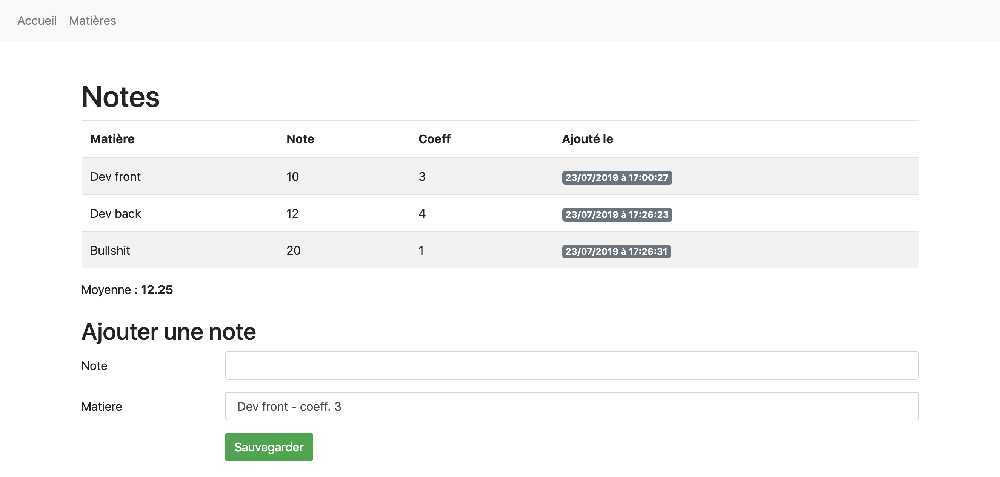
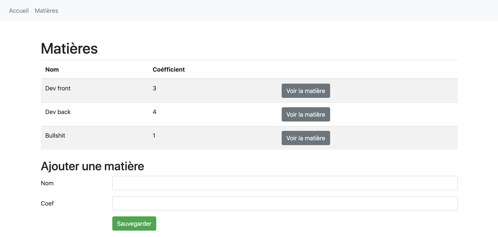
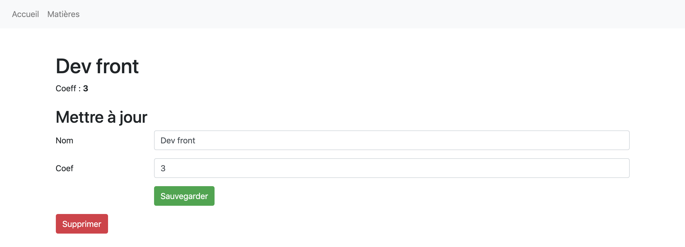

# Exercice 3

__Vous devez réaliser une application sur Symfony 5 qui permet de calculer des moyennes.__

_Règle de calcul d'une moyenne_
```
(note1 * coeffMatiere) + (note2 * coeffMatiere) + etc
-----------------------------------------------------
               total des coefficients
```

Pour cet exercice on considère qu'il n'y à qu'un seul étudiant.

## Pages et fonctionnalités

### Page matières
Cette page liste toutes les matières et doit :
- Permettre d’__ajouter une nouvelle matière__,
- __Afficher toutes les matières__, avec pour chacune :
  - Son nom,
  - Son coefficient,
  - Un bouton permettant d’accéder à la page détaillant cette matière.

### Page matière
Cette page affiche le détail d’une matière et doit permettre de :
- __Modifier la matière__ à l’aide d’un formulaire,
- __Supprimer la matière__ à l’aide d’un bouton.

Lorsqu'une matière est supprimée, il faut supprimer ses notes.

### Page d’accueil
Cette page doit :

- Permettre d’__ajouter une note__ à l’aide d’un formulaire proposant :
  - Une liste déroulante de toutes les matières (cette liste doit afficher le nom de chaque matière, suivi de son coefficient. Exemple `Dev. Back - coeff. 4`),
  - Un input permettant de saisir la note.

Lors de l'ajout d'une note, il faut que le datetime soit sauvegardée automatiquement, sans qu'on ai à le préciser dans le formulaire ou le controller. Ce datetime permettra de savoir à quel date une note à été ajoutée.

Vous n'avez pas besoin de gérer la modification et la suppression de notes.

- __Lister toutes les notes de l'étudiant__, en affichant pour chacune :
  - La note,
  - La matière associée,
  - Le coefficient de la matière concernée,
  - La date d'ajout de la note sous la forme `jour/mois/année à heure:minutes:secondes`.

- __Afficher la moyenne de l'étudiant__.

S’il n’existe aucune matière, il faut proposer un lien vers la page Matières à la place du formulaire d'ajout de note.

## Contraintes particulières
__1.__ Votre site doit comporter un menu sur toutes les pages permettant d'accéder rapidement aux pages :

- matières,
- accueil (notes).

__2.__ Tous les textes que vous écrivez dans vos vues et dans les messages Flash doivent être traduits en :

- français,
- anglais.

__3.__ Tout formulaire doit faire l'objet :

- d'une vérification des champs envoyés,
- d'un message indiquant le succès ou les erreurs éventuellement rencontrées (les messages d'erreurs par défaut de Symfony suffisent).

__4.__ Votre code doit être prêt à mettre en ligne. Faites en sorte de ne pas avoir d'erreurs 500.

## Quelques captures d'exemple
Page Accueil :

Page Matières :

Page Matière :


# Evolution °1
Vous devez ajouter une gestion d'__utilisateurs__ à votre projet.

Chaque utilisateur possède les informations suivantes :
- `nom`,
- `prénom`,
- `photo`.

Les __notes doivent maintenant être rattachées à des utilisateurs__, en plus d'être rattachées à des matières.

### Page Utilisateur
Cette page doit :
- __liste les utilisateurs__ avec les données suivantes :
  - nom,
  - prénom,
  - photo,
  - moyenne de l'étudiant.
- possède un __formulaire d'ajout d'utilisateurs__.

Vous devez sauvegarder automatiquement la date de création de l'utilisateur.

Au clic d'un utilisateur, vous devez arriver sur son profil.

### Page profil
Cette page doit :
- afficher les informations de l'utilisateur (nom, prénom, photo, moyenne),
- posséder un __formulaire de modification__,
- afficher la __liste des notes__ de l'étudiant.
- permettre de __supprimer l'utilisateur__.

Lorsqu'un utilisateur est supprimé, il faut automatiquement supprimer sa photo.